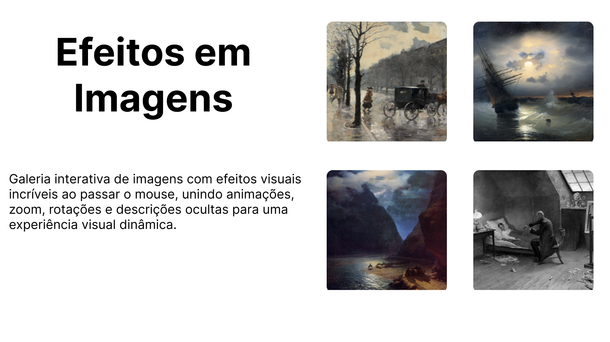

# Galeria de Imagens Interativa

🌟 Esta galeria de imagens totalmente interativa foi desenvolvida para demonstrar efeitos visuais avançados aplicados com HTML e CSS.  
🎨 Cada imagem possui animações únicas, incluindo zoom, rotações, batimentos, swing e luzes dinâmicas, criando uma experiência visual realmente envolvente para quem interage com o projeto.  

🖼️ Além disso, todas as imagens possuem descrições ocultas que aparecem suavemente ao passar o mouse, adicionando contexto e tornando a interação mais rica e divertida.  

✨ O projeto explora técnicas como transform, keyframes, hover e transitions, mostrando como pequenas interações podem transformar completamente a apresentação de conteúdo visual.  

💻 Desenvolvido como exercício do curso **“JavaScript do Básico ao Avançado + 132 Projetos Reais”** do Clevison Santos, este projeto é um ótimo exemplo de criatividade aliada a técnicas avançadas de CSS.  

🚀 Este projeto serve como inspiração para quem deseja criar interfaces dinâmicas e interativas, tornando o conteúdo visual muito mais atraente e profissional.
